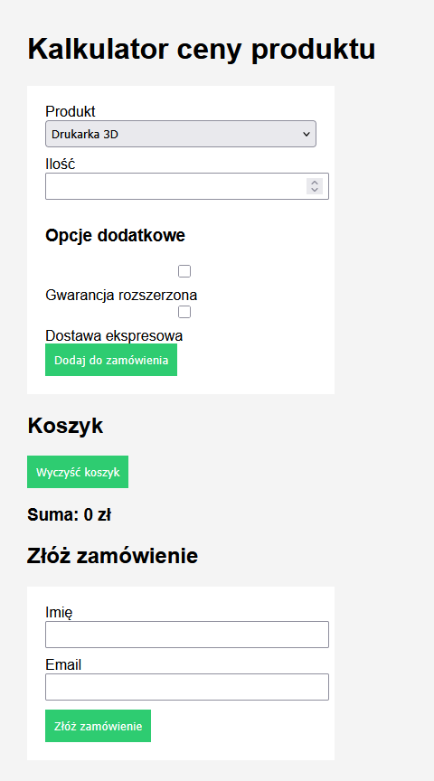

# kalkulator-zamowien-flask
Prosta aplikacja webowa do zamówień.

# Kalkulator zamówień Flask

Aplikacja webowa do obliczania ceny produktów i składania zamówień.

## Funkcje
- kalkulator ceny
- koszyk
- usuwanie produktów
- formularz zamówienia

## Technologie
- Python
- Flask
- HTML
- CSS

## Uruchomienie
pip install flask

python app.py

## Podgląd aplikacji

## Autor

Projekt wykonany w ramach praktyk zawodowych.
